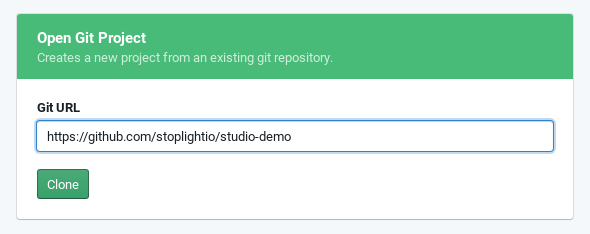
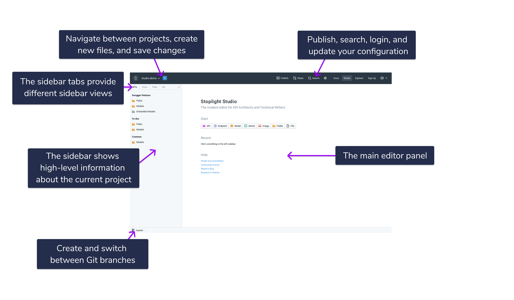
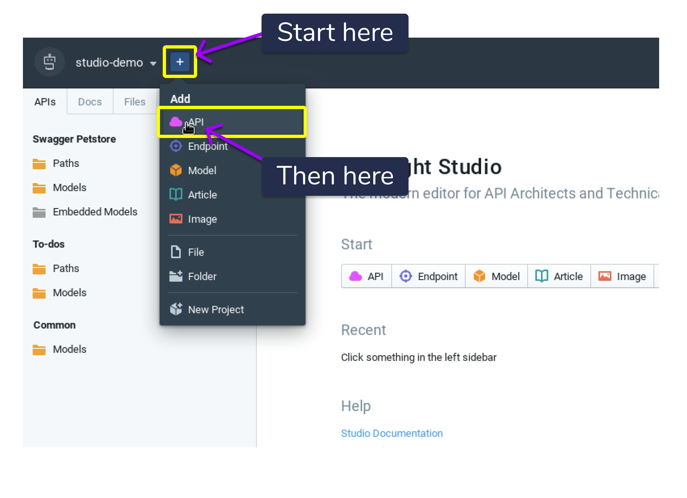
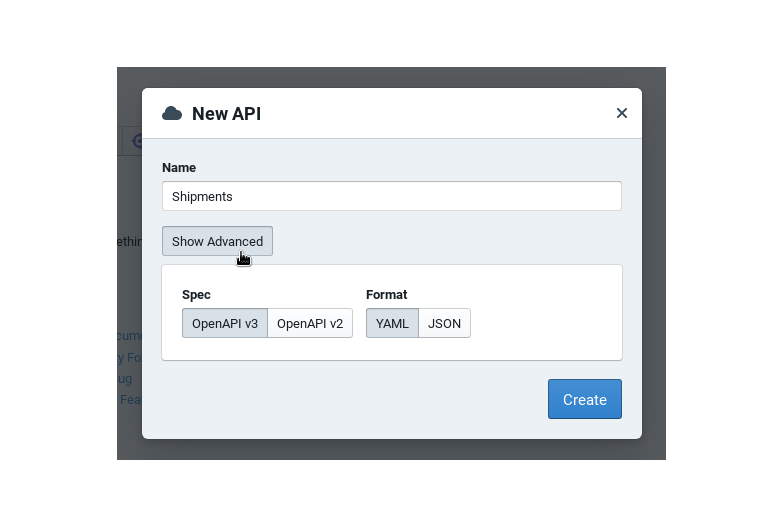

# Getting Started

## Creating Your First Project

The quickest way to get up and running with Studio is to clone an existing git repository. If you're running from the Studio desktop version, then this can be as easy as choosing a location on your computer where a repo already exists. If you're running from the browser, this can be as simple as pasting the URL to any Github repository that you'd like to add. Give it a shot with a sample project we've provided below.

https://github.com/stoplightio/studio-demo

Paste the URL above into the "Open Git Project" interface on the Studio landing screen and click "Clone".

> Even if you decide to go the "New Local Project" route, if 'Include tutorial files?' is checked then you're actually cloning the files from the Stoplight [public Studio repository](https://github.com/stoplightio/studio) (which also happens to be where this documentation is hosted). Pretty neat, right?

Assuming everything went to plan, you should now see a page resembling the one below.

> Note that the screenshot above was taken from the Studio web interface, so there may be some slight differences if you are using the Studio desktop application.

You have just created your first project! Be sure to review the [UI overview](./ui-overview) for quick highlights on the Studio user interface.

## Creating an API

To create a new API, use the menu immediately next to the project name and select "API".

From there you can name your API, and then optionally set the specification version (OpenAPI v2 or v3) and storage format (JSON or YAML).

> Be sure to check with any other vendors or tools that you may be integrating with prior to settling on a specification version or format. While OpenAPI version 3 may be the latest available, some tools and vendors do not yet offer full support.

After clicking "Create", a new API description document will be created and added to the project. From there you can then set the global information about the API and get started adding your first operation.

Continue on to the [API Design Guide](./API\ Design/10-getting-started) to get started designing APIs.