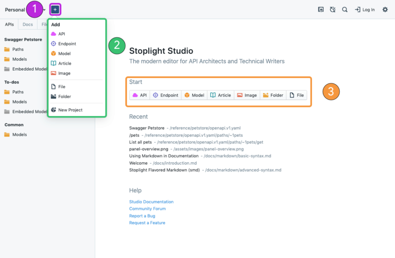

# Working with Files 

1. **+**: Create New File 
2. **Create New File Menu**
3. **Alternate Create New File Menu**: Only displays when no file is selected 

## What 
Studio supports 5 key API Design and Documentation files in multiple formats. The general categories for these files is located within the file creation dropdown (**+**). They include:
- **API**: API Description Documents 
- **Endpoint**: Individual Paths & Operations 
- **Model**: Reusable API Components
- **Article**: Supplemental Markdown Files 
- **Image**: Supplemental Images 

> There are also three other categories of files listed in the file creation dropdown: File (generic file creation), Folder (used for organizing content in your Git repository and Studio), & New Project (create a new Project)

> Folders are critical for accessing API Specification, Markdown, and Image files that aren’t formatted for Studio
 
## How 
1. **Create a New Project** or **Open an Existing Project** 
2. Click the **+** button 

### API 
1. Input a **Name** for your API 
2. Select **Show Advanced** to select between OpenAPI version and Format
3. Click **Create** 

### Endpoint 
1. Select an **API** to add the endpoint to 
2. Add a **Tag** to group similar endpoints together (Recommended) 
3. Input the endpoint’s **Path** 
4. Click **Create** 

### Model 
1. Input a **Name** for your model 
2. Add a **Tag** to group similar models together (Recommended) 
3. Choose the **Scope** for your model 

> Common models are accessible across all APIs within that Project. 

4. Select **Show Advanced** to input a Version and select the Format
5. Click **Create** 

### Article
1. Input a **Title** for your markdown file 
2. Add a **Tag** to group similar markdown files together 
3. Click **Create** 

### Image 
1. Select an image file from local disk 

### File 
1. Input a filename 
2. Press Enter 

### Folder 
1. Input a folder name 
2. Press Enter 

### New Project 

#### New Personal Project
1. Input a **Project Name** 
2. Click **Create** 

#### Open Git Project 
1. Input Git URL 
2. Click **Clone** 

#### Open Existing Folder 
1. Select a folder from local disk 
