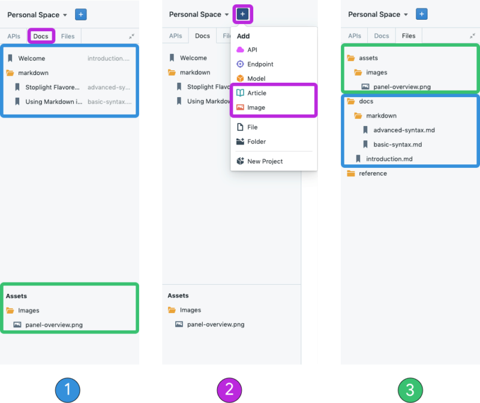

# Directory Structure (Documentation) 

1. **Docs File tree**
2. **Create a New File** 
3. **Files File tree** 

## What 

### Files Created Within Studio
Stoplight Studio’s directory structure (aka file tree structure) organizes and displays accessible files in Studio. Documentation specific files (markdown and image files) can be viewed within the File tree **Docs** tab and all files can be viewed within the **Files** tab.

### Files Uploaded to Studio
To publish and modify Markdown files created outside of Studio, they must be stored within the **docs** folder. To publish and modify images created outside of Studio, they must be stored within the **assets/images** folder. 

## How 

### Files Created Within Studio 
1. [Add a markdown or image file via the UI](../Workflow/working-with-files.md)
2. The file will be visible within the **Docs** file tree tab
3. Switch to the **File** file tree (**optional**)
4. Open the **docs** folder to view created markdown file 
5. Open the **assets/images** folder to view uploaded images

### Markdown Files Uploaded to Studio 
1. [Clone your Git Repository](../Workflow/working-with-git.md)
2. Click the **+** button and select **Folder** from the dropdown 

> Alternative Solution: Right-click on the file tree and select **New Directory** 

3. Input **docs** for the new folder/directory name 
4. Drag drop existing markdown files into the newly created **docs** folder 
5. Those markdown files will now be accessible in Studio’s Docs file tree 

### Image Files Uploaded to Studio 
1. [Clone your Git Repository](../Workflow/working-with-git.md)
2. Click the **+** button and select **Folder** from the dropdown 

> Alternative Solution: Right-click on the file tree and select **New Directory** 

3. Input **assets/images** for the new folder/directory name 
4. Drag drop existing image files into the newly created **assets/images** folder 
5. Those image files will now be accessible in Studio’s Docs filetree 

